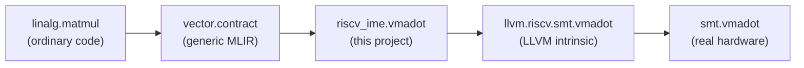

# SpacemiT IME Integration with LLVM and IREE

  
  
  
  
  

Teaching the LLVM/IREE compiler stack to recognize an ordinary matrix
multiply and automatically use SpacemiT's Integer Matrix Extension (IME) —
a RISC-V hardware instruction (`vmadot`) built for int8 matrix
multiply-accumulate — without changing the source code being compiled.

## How it flows

## The result

Compiled the same, unmodified matrix multiply two ways — once with the
hardware extension enabled, once without — and measured it on a real
RISC-V board.

| | With `vmadot` | Without `vmadot` |
|---|---|---|
| Time per call (64×64 int8 matmul) | ~0.252 ms | ~0.510 ms |

Roughly 2x faster, and the compiler made that choice on its own.

## Why three phases

| Phase | What it does |
|---|---|
| [Phase 1 — LLVM](phase-1-llvm/) | Teaches the compiler the instruction exists at all — builtin, intrinsic, RISC-V backend support |
| [Phase 2 — IREE ukernel](phase-2-iree/) | Proves the instruction actually works, by hand-writing one call to it |
| [Phase 3 — MLIR/IREE](phase-3-mlir/) | Teaches the compiler to find opportunities to use it on its own, in ordinary code — this is what produced the benchmark above |

Each folder contains only the files that were added or changed, with a
README covering what was built, what broke, and how it was fixed.

## Hardware

SpacemiT X60 (RISC-V, RVV), tested on a Banana Pi BPI-F3.
